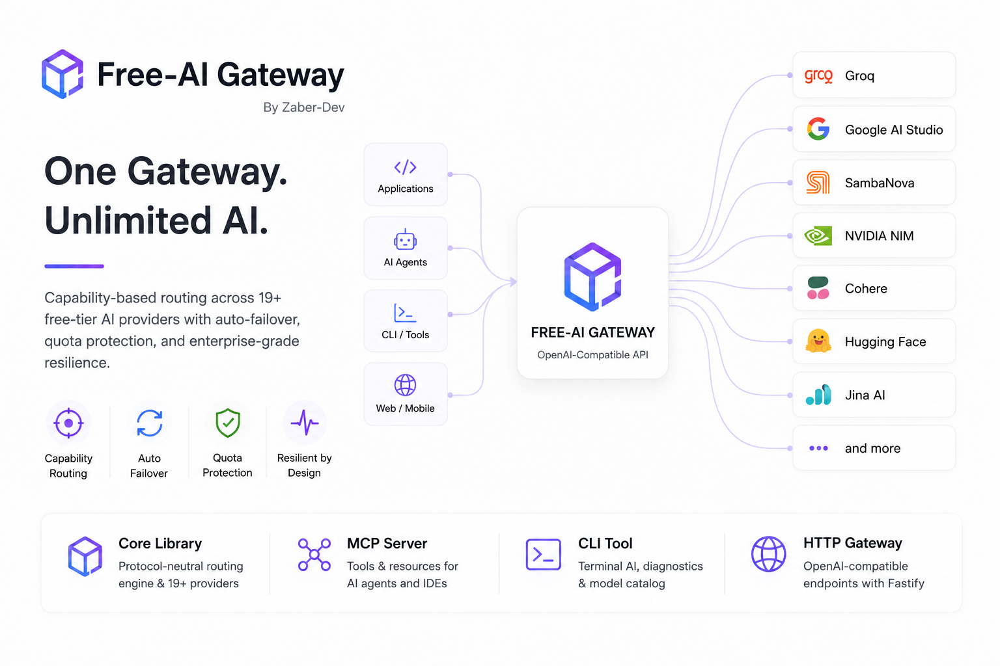
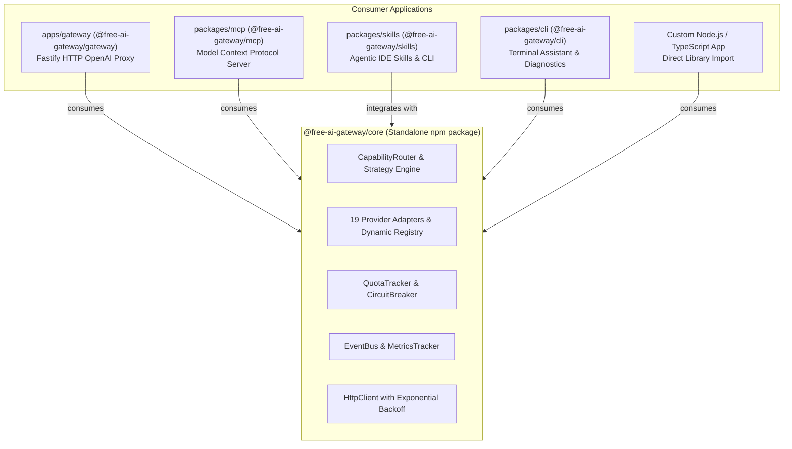

<div align="center">



# ⚡ Free-AI Gateway

**Enterprise-grade capability-routed AI Gateway monorepo aggregating free-tier AI APIs into reusable libraries, Model Context Protocol (MCP) servers, and OpenAI-compatible HTTP proxies.**

[](LICENSE)
[](https://www.typescriptlang.org/)
[](https://nodejs.org/)
[](https://fastify.dev/)
[](Dockerfile)
[](LEARN.md)
[](CONTRIBUTING.md)

</div>

> 📚 **New to Free-AI Gateway?** Check out the comprehensive **[Architecture & Developer Guide (LEARN.md)](LEARN.md)** for detailed deep dives, tutorials, and integration patterns.

---

## 📖 Architecture & Monorepo Overview

**`free-ai-gateway`** is organized as an enterprise monorepo separating **pure AI orchestration infrastructure** from **protocol-specific delivery mechanisms** (HTTP Fastify Proxy & MCP Server):



### Monorepo Workspaces Matrix

| Package / App | Location | Purpose | Dependencies |
| :--- | :--- | :--- | :--- |
| **`@free-ai-gateway/core`** | `packages/core` | Protocol-neutral capability router, resilience engine, and 19 provider adapters. | `ajv`, `dotenv` (Zero HTTP server) |
| **`@free-ai-gateway/mcp`** | `packages/mcp` | Model Context Protocol server exposing capability tools to AI agents (Claude Desktop, Cursor). | `@free-ai-gateway/core` |
| **`@free-ai-gateway/skills`** | `packages/skills` | Agentic IDE skills (`SKILL.md`) and installer CLI for Antigravity, Claude, Cursor, and Copilot. | Standalone CLI & API |
| **`@free-ai-gateway/cli`** | `packages/cli` | Terminal AI assistant, interactive chat REPL, model catalog, and diagnostics tool. | `@free-ai-gateway/core`, `@free-ai-gateway/skills` |
| **`@free-ai-gateway/gateway`** | `apps/gateway` | High-throughput Fastify HTTP proxy serving OpenAI-compatible endpoints with auto-discovery. | `@free-ai-gateway/core`, `fastify` |

---

## ✨ Key Capabilities

- 🎯 **Capability-Based Routing**: Request what you need (`model: "auto:tool_calling+structured_output"`), and let the router choose the fastest healthy free provider.
- 📐 **Strategy Pattern Engine**: Pluggable load balancing strategies (`AdaptiveHealthStrategy`, `LowestLatencyStrategy`, or custom `IRoutingStrategy`).
- 🔄 **Autonomous Failover**: Transparently cycles through ranked candidate providers until success upon encountering upstream `429` (Rate Limit) or `5xx` errors.
- 🛡️ **Circuit Breaker**: Detects failing providers and enters exponential cooldown backoff to prevent cascade failures.
- ⏱️ **Sliding-Window Quota Tracking**: In-memory accounting of RPM, TPM, and RPD with proactive limit protection.
- 🔌 **Dynamic Provider Autoloader**: Add new providers by dropping a class extending `BaseProvider` into `packages/core/src/providers/`.
- 📡 **Typed Event Bus**: Lifecycle events (`request:start`, `request:success`, `request:fallback`, `provider:rate_limited`) for OpenTelemetry and Prometheus observability.
- 🤖 **Model Context Protocol (MCP) Ready**: Use directly in Claude Desktop, Cursor, or agent workflows.

---

## 🧩 Supported Providers Matrix (19 Adapters)

| Provider | Modalities / Capabilities | Authentication | Limit Scope |
| :--- | :--- | :--- | :--- |
| **Google AI Studio** | `text`, `tool_calling`, `vision`, `structured_output`, `embedding`, `tts` | `GOOGLE_API_KEY` | Per Model |
| **Groq** | `text`, `tool_calling`, `structured_output`, `reasoning`, `speech_to_text` | `GROQ_API_KEY` | Account |
| **SambaNova Cloud** | `text`, `tool_calling`, `reasoning`, `vision` | `SAMBANOVA_API_KEY` | Account |
| **NVIDIA NIM** | `text`, `tool_calling`, `reasoning`, `vision`, `embedding`, `rerank`, `moderation` | `NVIDIA_API_KEY` | Account |
| **Cohere** | `text`, `tool_calling`, `structured_output`, `reasoning`, `embedding`, `rerank` | `COHERE_API_KEY` | Account |
| **OpenRouter** | `text`, `tool_calling`, `vision`, `reasoning`, `embedding`, `tts`, `moderation` | `OPENROUTER_API_KEY` | Account |
| **OpenCode Zen** | `code`, `tool_calling`, `reasoning`, `text` | `OPENCODE_API_KEY` | Account |
| **Bazaarlink.ai** | `text`, `code` | `BAZAARLINK_API_KEY` | Account |
| **aimlapi.com** | `text` | `AIMLAPI_API_KEY` | Account |
| **OVHcloud AI** | `text` | `OVHCLOUD_API_KEY` | Per Model |
| **Voyage AI** | `embedding` | `VOYAGE_API_KEY` | Account |
| **Jina AI** | `embedding`, `rerank` | `JINA_API_KEY` | Account |
| **Hugging Face** | `text`, `tool_calling`, `image_gen` | `HUGGINGFACE_API_KEY` | Shared Pool |
| **Cloudflare Workers AI** | `image_gen`, `embedding` | `CLOUDFLARE_API_TOKEN` | Shared Pool |
| **Google Cloud Platform** | `translation`, `speech_to_text`, `text_to_speech`, `vision` | `GCP_API_KEY` | Account |
| **MyMemory** | `translation` | `MYMEMORY_API_KEY` | Account |
| **Unstructured.io** | `document_processing` | `UNSTRUCTURED_API_KEY` | Account |
| **Exa AI** | `web_search` | `EXA_API_KEY` | Account |
| **Tavily** | `web_search` | `TAVILY_API_KEY` | Account |

---

## 🚀 Quick Start

### 1. Installation

```bash
# Clone the repository
git clone https://github.com/zaber-dev/free-ai-gateway.git
cd free-ai-gateway

# Install dependencies across all monorepo workspaces
npm install
```

### 2. Configure Environment

Copy `.env.example` to `.env` and provide keys for the providers you wish to enable:

```bash
cp .env.example .env
```

```env
PORT=3000
GROQ_API_KEY=gsk_...
GOOGLE_API_KEY=AIza...
NVIDIA_API_KEY=nvapi-...
COHERE_API_KEY=...
```

### 3. Build & Run

```bash
# Compile all workspace packages
npm run build

# Run all 31 automated tests across all packages
npm test

# Start the Fastify HTTP Gateway (Dev mode)
npm run dev

# Start the Gateway in Production
npm start
```

---

## 💻 Usage Modalities

### Option A: HTTP Gateway (OpenAI Compatible)

Call the local proxy with any OpenAI SDK or `curl`:

```bash
curl http://localhost:3000/v1/chat/completions \
  -H "Content-Type: application/json" \
  -d '{
    "model": "auto:tool_calling+structured_output",
    "messages": [
      { "role": "user", "content": "Extract name and age from: Alice is 30 years old." }
    ]
  }'
```

```typescript
import OpenAI from "openai";

const client = new OpenAI({
  baseURL: "http://localhost:3000/v1",
  apiKey: "not-needed",
});

const completion = await client.chat.completions.create({
  model: "auto:reasoning",
  messages: [{ role: "user", content: "Solve: How many r's in strawberry?" }],
});

console.log(completion.choices[0].message.content);
```

---

### Option B: Embedding `@free-ai-gateway/core` as a TypeScript Library

Embed the capability router directly into your application without launching an HTTP server:

```typescript
import {
  CapabilityRouter,
  Registry,
  QuotaTracker,
  CircuitBreaker,
  EventBus,
  LowestLatencyStrategy,
} from "@free-ai-gateway/core";

const registry = new Registry();
const quota = new QuotaTracker();
const breaker = new CircuitBreaker();
const eventBus = new EventBus();

// Listen to lifecycle telemetry
eventBus.on("request:fallback", (evt) => {
  console.warn(`[Fallback] Failed on ${evt.attemptedProvider}: ${evt.error}`);
});

const router = new CapabilityRouter(
  registry,
  quota,
  breaker,
  undefined,
  eventBus,
  new LowestLatencyStrategy()
);

const response = await router.route({
  capabilities: ["text", "tool_calling"],
  payload: {
    messages: [{ role: "user", content: "Hello AI!" }],
  },
});

console.log("Served by:", response.servedBy);
console.log("Data:", response.data);
```

---

### Option C: Model Context Protocol (MCP) Server

Connect Free-AI Gateway to Claude Desktop or Cursor:

```json
{
  "mcpServers": {
    "free-ai-gateway": {
      "command": "node",
      "args": ["/path/to/free-ai-gateway/packages/mcp/dist/index.js"],
      "env": {
        "GROQ_API_KEY": "gsk_...",
        "GOOGLE_API_KEY": "AIza..."
      }
    }
  }
}
```

**Exposed MCP Tools:**
* `freeai_generate`: Generate text, reasoning, or code with automatic failover.
* `freeai_search`: Web search queries via Exa / Tavily.
* `freeai_embed`: Generate vector embeddings via Voyage, Jina, Gemini.
* `freeai_rerank`: Rerank documents for retrieval augmented generation (RAG).
* `freeai_analyze_image`: Multimodal vision analysis.

---

### Option D: Agentic IDE Skills (`@free-ai-gateway/skills`)

Install Free-AI Gateway agent skills directly into your IDE or autonomous coding assistant:

```bash
# Install to Google Antigravity (.agents/skills)
npx @free-ai-gateway/skills install --target=antigravity

# Install to Cursor (.cursor/skills)
npx @free-ai-gateway/skills install --target=cursor

# Install to Claude Code (.claude/skills)
npx @free-ai-gateway/skills install --target=claude

# Install to all supported AI assistants
npx @free-ai-gateway/skills install --target=all
```

---

### Option E: Terminal CLI Tool (`@free-ai-gateway/cli`)

Use Free-AI directly from your terminal or command-line scripts:

```bash
# One-off prompt execution with auto-routing
npx @free-ai-gateway/cli "Explain MapReduce in simple terms"

# Interactive chat REPL in terminal
npx @free-ai-gateway/cli chat --capability=reasoning

# Check model catalog across all 19 providers
npx @free-ai-gateway/cli models

# Run system diagnostics
npx @free-ai-gateway/cli doctor
```

---

## 🏛️ Monorepo Structure

```
free-ai-gateway/
├── packages/
│   ├── core/                        # @free-ai-gateway/core
│   │   ├── AGENTS.md                # Agentic guidelines for @free-ai-gateway/core
│   │   ├── src/
│   │   │   ├── capabilities/        # Capability definitions & parsing
│   │   │   ├── config/              # providers.json, schema, config sources
│   │   │   ├── errors/              # ProviderError, NoProviderAvailableError
│   │   │   ├── observability/       # EventBus, MetricsTracker
│   │   │   ├── providers/           # 19 Provider Adapters + Registry + Loader
│   │   │   ├── resilience/          # QuotaTracker, CircuitBreaker
│   │   │   ├── router/              # CapabilityRouter & Strategy Pattern
│   │   │   ├── transport/           # HttpClient with exponential backoff
│   │   │   ├── types/               # Unified contracts & response schemas
│   │   │   └── index.ts             # Public Core API
│   │   ├── tests/                   # 20 Core unit tests
│   │   └── package.json
│   │
│   ├── mcp/                         # @free-ai-gateway/mcp
│   │   ├── AGENTS.md                # Agentic guidelines for @free-ai-gateway/mcp
│   │   ├── src/
│   │   │   ├── tools/               # generate, search, embed, rerank, analyze-image
│   │   │   ├── resources/           # capabilities, models catalog
│   │   │   ├── server.ts            # FreeAiMcpServer handler
│   │   │   └── index.ts
│   │   ├── tests/                   # 3 MCP server tests
│   │   └── package.json
│   │
│   ├── skills/                      # @free-ai-gateway/skills
│   │   ├── AGENTS.md                # Agentic guidelines for @free-ai-gateway/skills
│   │   ├── src/
│   │   │   ├── skills/              # Built-in skills (free-ai-gateway, scaffolding, mcp)
│   │   │   ├── installer.ts         # Multi-target installer
│   │   │   ├── cli.ts               # CLI executable (free-ai-skills)
│   │   │   └── index.ts
│   │   ├── tests/                   # 4 Skills tests
│   │   └── package.json
│   │
│   └── cli/                         # @free-ai-gateway/cli
│       ├── AGENTS.md                # Agentic guidelines for @free-ai-gateway/cli
│       ├── src/
│       │   ├── commands/            # prompt, chat, models, doctor, skills
│       │   ├── cli.ts               # Argument parsing & dispatcher
│       │   ├── bin.ts               # CLI executable (free-ai, freeai)
│       │   └── index.ts
│       ├── tests/                   # 4 CLI tests
│       └── package.json
│
├── apps/
│   └── gateway/                     # @free-ai-gateway/gateway (HTTP App)
│       ├── AGENTS.md                # Agentic guidelines for @free-ai-gateway/gateway
│       ├── src/
│       │   ├── adapters/            # OpenAI chat response normalizer
│       │   ├── api/
│       │   │   ├── routes/          # Fastify route modules & RouteLoader
│       │   │   └── server.ts        # Server factory, timing hooks, 404 handler
│       │   ├── jobs/                # Background JobScheduler & reverify worker
│       │   └── index.ts
│       ├── tests/                   # 5 Gateway HTTP tests
│       ├── Dockerfile               # Monorepo container builder
│       └── package.json
│
├── tests/
│   └── e2e/                         # 5 Cross-package E2E integration tests
│
├── AGENTS.md                        # Monorepo Root Agentic Guidelines
├── CLAUDE.md                        # Claude Code Instructions
├── .agents/                         # Workspace Skills Directory
├── .github/workflows/ci.yml         # Matrix CI workflow
├── docker-compose.yml
├── package.json                     # Root workspace definition
├── tsconfig.base.json               # Shared TypeScript compiler settings
└── README.md
```

---

---

## 🤝 Community & Governance

- 📖 **[Architecture Blueprint](ARCHITECTURE.md)**: Deep dive into the internal system design and data flow.
- 🎓 **[Developer & Learning Guide](LEARN.md)**: Tutorials, programmatic usage, and SDK patterns.
- 🗺️ **[Product Roadmap](ROADMAP.md)**: Planned milestones, distributed state, and upcoming features.
- 💬 **[Support Guide](SUPPORT.md)**: Troubleshooting, community discussions, and help channels.
- 🏛️ **[Project Governance](GOVERNANCE.md)**: Decision-making process, maintainer roles, and release policies.
- ✍️ **[Contributing Guide](CONTRIBUTING.md)**: Step-by-step instructions for adding new provider adapters.
- 🔒 **[Security Policy](SECURITY.md)**: Vulnerability disclosure guidelines.
- 📜 **[Code of Conduct](CODE_OF_CONDUCT.md)**: Community standards and expectations.

---

## 👤 Author

Created and maintained with ❤️ by **[Md. Mahedi Zaman Zaber](https://github.com/zaber-dev)**.

---

## 📄 License

This project is open source and available under the [MIT License](LICENSE).

